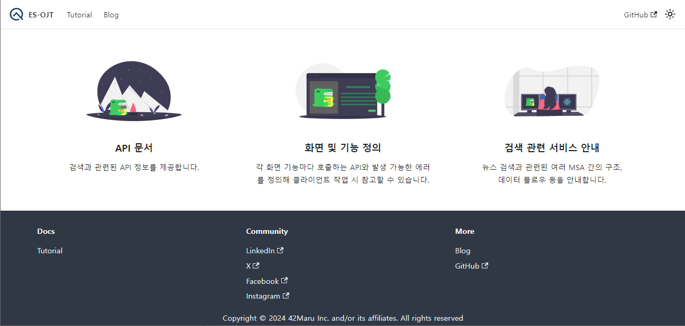

# es-ojt-collections

 
<picture>
  <source media="(prefers-color-scheme: dark)" srcset="images/42maru-cal-white.png" width=300>
  <source media="(prefers-color-scheme: light)" srcset="images/42maru-cal-color.png" width=300>
  
</picture>
  

이 레포지토리는 42MARU와 캘의 Elasticsearch OJT 프로젝트를 관리하기 위한 레포지토리 저장소입니다.

## es-ojt 관련 레포지토리

| Repositories                                                 | Summary                                                      | ETC                          |
| ------------------------------------------------------------ | ------------------------------------------------------------ | ---------------------------- |
| [es-ojt-collections](https://github.com/CalMaru/es-ojt-collections) | - es-ojt 관련 레포지토리 모음 - es-ojt 개발 문서 페이지 관리 |                              |
| [es-ojt-data](https://github.com/CalMaru/es-ojt-data)        | - Kafka를 이용한 뉴스 데이터 전처리 수행 - Elasticsearch에 뉴스 데이터 적재 - API를 이용한 Elasticsearch 인덱스, 데이터 관리 | - Kafka / API 개발 계획 없음 |
| [es-ojt-api](https://github.com/CalMaru/es-ojt-api)          | 뉴스 검색 백엔드 API                                         |                              |

## es-ojt 문서 페이지

이 레포지토리에서는 es-ojt에서 제공하는 뉴스 검색 서비스에 대한 개발 문서 웹페이지를 관리합니다. 개발 문서를 빌드하고 배포하기 위한 방법은 [여기](docs/README.md)를 참고해주세요.

