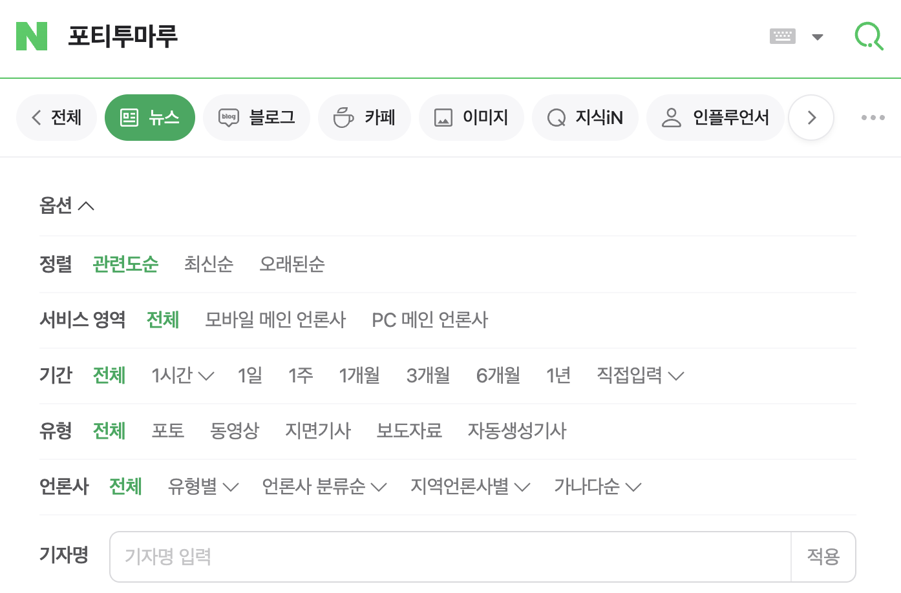

Elasticsearh를 이용해 뉴스를 검색하는 과제를 하게 됐습니다. 이 장에서는 제가 받은 뉴스 과제의 요구사항과 목표를 살펴보고, 어떻게 문제를 해결하면 좋을지 정리하겠습니다.

## 요구사항 {#requirements}

과제 목표부터 살펴보겠습니다.

### 과제 목표 {#requirements-purpose}

1. `검색`의 이해
2. 네이버 뉴스보다 좋은 검색 품질의 검색 시스템 구축

Elasticsearh를 이용해 검색 기능을 구현하고, `좋은 검색 품질`이 무엇인지를 정의해 네이버 뉴스 검색과 품질 비교가 가능하다면 과제 목표를 이룰 수 있겠습니다.

### 과제 상세 {#requirements-details}

:::info
이 문서에서는 자동 완성 기능과 유사 문서 검색 기능이 제외된 요구사항을 다룹니다(2024-04-29 기준).
:::

1. 키워드 검색
2. 검색 옵션 ([네이버 검색 옵션](https://help.naver.com/service/5603/contents/19113?lang=ko) 참고)
   1. 정렬
   2. 기간
   3. 언론사
   4. 기자명
3. 검색 결과
   1. 네이버와 동일한 검색 결과 형식 사용
   2. 화면 개발 없이 Postman으로 결과 확인
4. 데이터
   - 빅카인즈 뉴스 데이터 20000건 (2021년 1월 ~ 2021년 9월)

## 과제 분석 {#analysis}

위의 [과제 상세](#requirements-details)의 각 항목들을 이해하려면 네이버 뉴스 검색이 어떤 식으로 동작하는지 분석해야 합니다. 이번 절에서는 네이버 검색이 어떻게 동작하는지 살펴보고, 과제를 진행하기에 앞서 어떤 서비스를 OJT에서 제공해야 하는지, 어떻게 준비하면 좋을지 살펴보겠습니다.

### 네이버 뉴스 검색과의 비교 {#analysis-naver}

네이버 뉴스에서 `포티투마루`를 검색하고 옵션 메뉴를 열어보면 다음과 같은 화면이 나옵니다. 옵션 항목에는 `정렬`, `서비스 영역`, `기간`, `유형`, `언론사`, `기자명`이 있습니다. 이 중 `서비스 영역`은 네이버 뉴스의 PC와 모바일 환경에 따른 옵션이므로, 이 과제에서 구현할 옵션 항목에서 제외합니다.

빅카인즈 데이터를 뒤에서도 살펴 보겠지만, 과제에서 사용하는 데이터에는 네이버 뉴스 옵션에서 제공하는 `유형` 항목을 구별할 만한 목이 없으므로 `유형` 항목도 제외하도록 하겠습니다.

### 네이버 뉴스 검색 - 기간

import Naver1Hour from "./img/naver_news_period_1_hour.png";
import Naver1Day from "./img/naver_news_period_1_day.png";
import NaverInput from "./img/naver_news_period_input.png";

|  |  |  |
| ---------------------------------------------------------------- | -------------------------------------------------------------- | ---------------------------------------------------------------- |
| s                                                                | s                                                              | s                                                                |

### 네이버 뉴스 검색 - 언론사

### 네이버 뉴스 검색 - 기자명

### 네이버 뉴스 검색 결과
